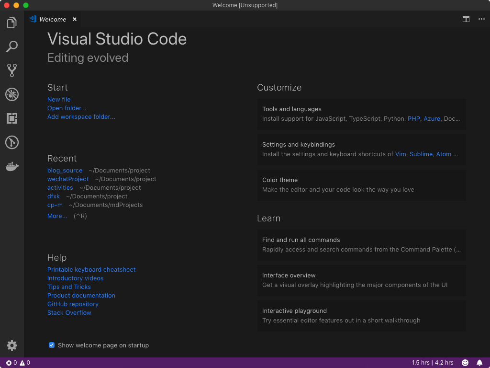
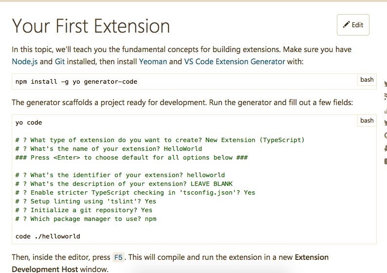
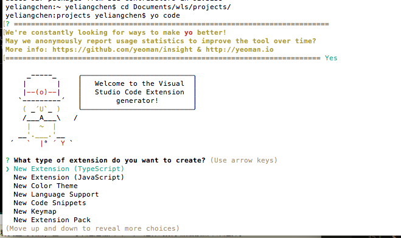
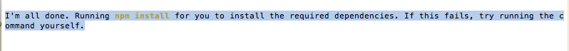
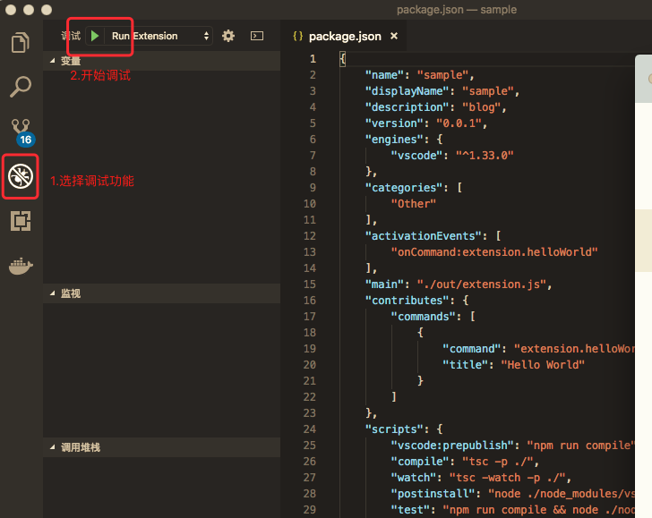
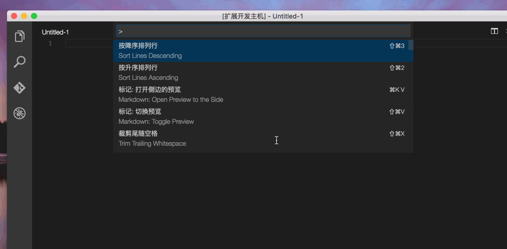
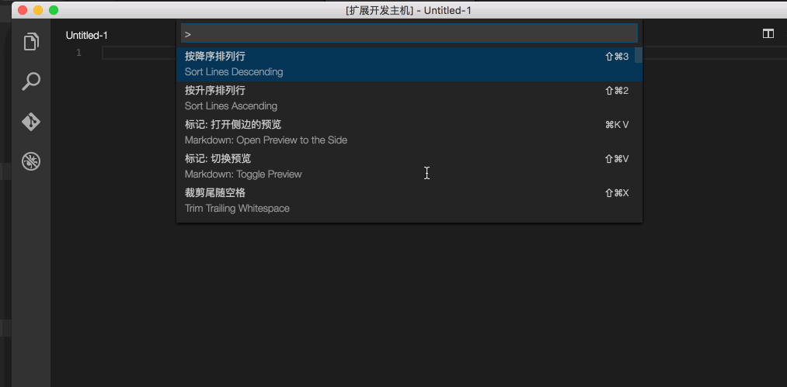
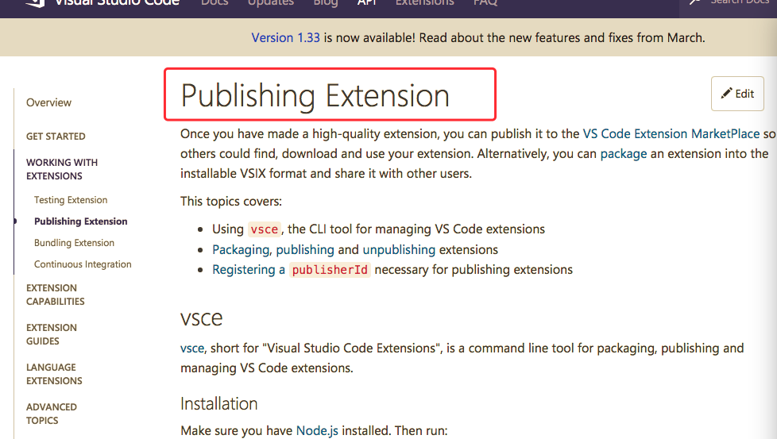

title: 做个属于自己的Visual Studio Code第三方扩展
author: LS
categories: 手册
date: 2019-04-17 16:28:41
tags:
keywords: [VisualStudioCode、vsCode、vsCode扩展、Extension、第三方扩展]
description: 做个属于自己的Visual Studio Code第三方扩展。
---
## 前言

清明节后，新项目提测，技术这边除了解决产品、测试提出的问题外，还是挺有空的。荒废了几天后的今天，突然想到博客貌似好久没更新，打开一看，最近一篇居然是4个月前的，还只是篇关于工具调试方面的小记录而已。赶紧打开代码，选个题材，立志今天要撸一篇完整的文档更新上线。

想了下，过完年后回来干了啥，要选什么题材呢，最后决定写自己在年后尝试写的vsCode小插件。

先聊聊编译器，`vsCode` 是众多编译器中比较受欢迎的其中一种，上学时大家对代码还是很懵的，只知道Dreamweaver这种可以界面操作的工具，总的来说没有一个Web编辑软件能像 `Dreamweaver` 一样，具有所见即所得的功能，你可以在窗体中调整参数，即刻看到它的改变，Dreamweaver会自动生成HTML文件格式，供欲览，以便开发人员进一步调整。在初期，大部分基础前端应该都了解文本编辑器 `Sublime Text`，简洁又轻便，再加上它的快捷键是真的无敌呀，在这点上，vsCode是比不上Sublime的。后面随着潮流，大家都用上了vsCode，在某些方面，它是优于sublime的，主要体现在编译器里融合了命令行工具，支持 GIT 版本管理，支持第三方扩展。



vsCode的第三方扩展因为开放性的特性所以特别强大，任何人有好的idea都能自己写个插件共享大家。
接下来我们要说的就是如何在vsCode中有属于自己的第三方扩展。

## 开发环境介绍与安装

首先我们先需要一个生产基本插件代码的工具，那就是[Yeoman](https://yeoman.io/) 和 [VS Code Extension generator](https://code.visualstudio.com/api/get-started/your-first-extension)，`VS Code Extension generator`详细的介绍了如何从安装generator-code开始到有一个完整的Extension，总的来说API很友好。



根据官网api提示，确保安装了[Node.js](https://nodejs.org/en/)的条件下，在我们的 `cmd` 输入以下命令全局安装 `yo` 和 `generator-code`:

```
$ npm install -g yo generator-code
```

在完成上面的安装后，可以通过输入以下命令来生成我们要的基本代码:

```
$ yo code
```


> 根据提示选择创建项目的配置类型.

- 选择Typescript还是Javascript类型的项目
- 输入你扩展的名称
- 输入一个标志（项目创建的文件名称用这个）
- 输入对这个扩展的描述
- 输入以后要发布用到的一名称（和以后再发布时候有一个名字是对应上的）
- 要不要创建一个git仓库用于版本管理



提示你全部生成完毕，运行 `npm install` 来安装你的项目依赖。

````
├── .gitignore                  //配置不需要加入版本管理的文件
├── .vscode                     // VS Code的整合
│   ├── launch.json
│   ├── settings.json
│   └── tasks.json
├── .vscodeignore                //配置不需要加入最终发布到拓展中的文件
├── README.md
├── src                         // 源文件
│   └── extension.ts            // 如果我们使用js来开发拓展，则该文件的后缀为.js
├── test                        // test文件夹
│   ├── extension.test.ts       // 如果我们使用js来开发拓展，则该文件的后缀为.js
│   └── index.ts                // 如果我们使用js来开发拓展，则该文件的后缀为.js
├── node_modules
│   ├── vscode                  // vscode对typescript的语言支持。
│   └── typescript              // TypeScript的编译器
├── out                         // 编译之后的输出文件夹(只有TypeScript需要，JS无需)
│   ├── src
│   |   ├── extension.js
│   |   └── extension.js.map
│   └── test
│       ├── extension.test.js
│       ├── extension.test.js.map
│       ├── index.js
│       └── index.js.map
├── package.json                // 该拓展的资源配置文件
├── tsconfig.json               // 
├── typings                     // 类型定义文件夹
│   ├── node.d.ts               // 和Node.js关联的类型定义
│   └── vscode-typings.d.ts     // 和vsCode关联的类型定义
└── vsc-extension-quickstart.md 
````

## 运行与简单修改

介绍完目录结构后，我们可以来运行一下看看效果如果。我们打开一个vscode并把我们的sample目录自己拖拉到vscode的界面上，然后选择调试窗口，并点击开始调试。



项目运行起来后，会调用一个新的vscode窗口在标题栏的地方显示一个 `[扩展开发主机]` 的标题，然后这个窗口是支持我们刚才运行的插件项目的命令。



我们可以看到扩展插件已经正常的运行了，接下来我们可以来简单修改一下代码以实现不同的简单功能。在修改之前需要简单的认识两个文件:

> package.json

```
{
    "name": "sample"，              //插件扩展名称（对应创建项目时候的输入）
    "displayName": "sample"，
    "description": "blog sample"，  //插件扩展的描述（对应创建项目时候的输入）
    "version": "0.0.1"，
    "publisher": "caipeiyu",       //发布时候的一个名称（对应创建项目时候的输入）
    "engines": {
        "vscode": "^0.10.10"
    },
    "categories": [
        "Other"
    ],
    "activationEvents": [          //这是我们要理解的地方，是触发插件执行一些代码的配置
        "onCommand:extension.sayHello" //这种是通过输入命令来触发执行的
    ],
    "main": "./out/src/extension",  //这个是配置TypeScript编译成js的输出目录
    "contributes": {
        "commands": [{             //title 和 command是一个对应关系的
            "command": "extension.sayHello", //这个是对应上面那个命令触发的，在代码里面也要用到
            "title": "Hello World"   //这个是我们在vscode里面输入的命令
        }]
    },
    "scripts": {                     //是在发布打包，或者其他运行时候，要执行的一些脚本命令
        "vscode:prepublish": "node ./node_modules/vscode/bin/compile",
        "compile": "node ./node_modules/vscode/bin/compile -watch -p ./",
        "postinstall": "node ./node_modules/vscode/bin/install"
    },
    "devDependencies": {           //这是开发的依赖包，如果有其他的依赖包，并要打包的话，需要把dev去掉
        "typescript": "^1.8.5",
        "vscode": "^0.11.0"
    }
   }
```

> extension.ts

```
'use strict';
// The module 'vscode' contains the VS Code extensibility API
// Import the module and reference it with the alias vscode in your code below
import * as vscode from 'vscode';

// this method is called when your extension is activated
// your extension is activated the very first time the command is executed
export function activate(context: vscode.ExtensionContext) {

    // Use the console to output diagnostic information (console.log) and errors (console.error)
    // This line of code will only be executed once when your extension is activated
    console.log('Congratulations, your extension "sample" is now active!');

    // The command has been defined in the package.json file
    // Now provide the implementation of the command with  registerCommand
    // The commandId parameter must match the command field in package.json
    let disposable = vscode.commands.registerCommand('extension.sayHello', () => {
        //只看这个地方'extension.sayHello'和 package.json 里面的 "onCommand:extension.sayHello" 是一个对应关系
        // The code you place here will be executed every time your command is executed

        // Display a message box to the user
        vscode.window.showInformationMessage('Hello World!');
    });

    context.subscriptions.push(disposable);
    }

    // this method is called when your extension is deactivated
    export function deactivate() {
    }
```

这两个文件是很重要的，基本整个插件编写都是围绕着这两个文件来修改的，例如我们现在要增加多一个命令叫做 `Hello Sample` 那么我们先在 `package.json` 里面添加两个配置。

````
...
"activationEvents": [
    "onCommand:extension.sayHello",
    "onCommand:extension.saySample"
],
"contributes": {
    "commands": [{
        "command": "extension.sayHello",
        "title": "Hello World"
    },{
        "command": "extension.saySample",
        "title": "Hello Sample"
    }]
}, 
... 
````

添加完这两个配置后，我们就需要在 [extension.ts]() 里来注册这个命令事件:

```
let disposable = vscode.commands.registerCommand('extension.sayHello', () => {
    vscode.window.showInformationMessage('Hello World!');
});

context.subscriptions.push(disposable);

let saySample = vscode.commands.registerCommand('extension.saySample', () => {
    vscode.window.showInformationMessage('This is a new sample command!');
});
context.subscriptions.push(saySample);
```

修改完代码后，再次运行效果如下图:



## 打包与发布

### vsce

依旧，官网中也提到如何将扩展打包发布，以便其他人可以查找，下载和使用您的扩展程序或者打包成可安装的 `VSIX` 格式.并与他人分享。



`vsce` 是 `Visual Studio Code Extensions` 的缩写，是用于打包，发布和管理vsCode扩展的命令行工具。

```
$ npm install -g vsce
```

> 您可以使用[vsce]()它轻松打包和发布扩展程序：

```
$ cd sample
$ vsce package
# sample.vsix generated
# Created: /sample/sample-0.0.1.vsix
$ vsce publish
# <publisherID>.sample published to VS Code MarketPlace
```

生成的 `vsix` 就是我们打包好的插件安装包，只要将其拖到vsCode的窗口上，即会提示你安装成功重启 `vsCode`，重启restate后便能使用扩展中的命令.而且在插件的目录下也多了对应sample的目录。

`vsce` 还可以搜索，获取元数据和取消发布扩展。有关所有可用 `vsce` 命令的参考，请运行`vsce --help`。

### Publishing extensions

[官网](https://code.visualstudio.com/api/working-with-extensions/publishing-extension#get-a-personal-access-token)中介绍到如果你想将自己写的扩展分享给更多的人使用就要注册[Azure DevOps organization](https://docs.microsoft.com/zh-cn/azure/devops/organizations/accounts/create-organization?view=azure-devops)的账号.

具体发布步骤根据官网提示顺序操作即可。