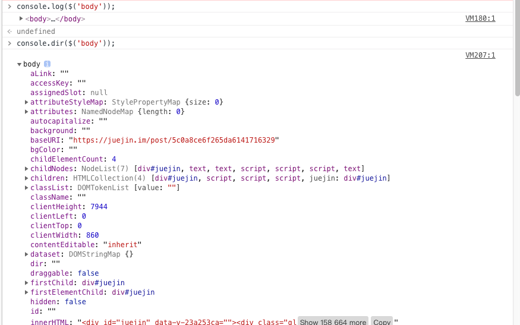

title: 比console.log好用的调试工具
author: LS
date: 2018-12-12 10:49:35
tags:
keywords: Web、Web API接口、console.dir
description: console.dir在控制台中显示指定JavaScript对象的属性，并通过类似文件树样式的交互列表显示。
---
前端最常使用 `console.log` 用来将数据、错误信息以格式化的形式打印出来,但有时候我想通过类似文件树样式的交互列表打印出一个 `DOM` 节点的所关联的js对象、它的属性，而不是像从 `Elements` 中剪切出来一样。

这时候就可以用 `console.dir`：

> 非标准
> 该特性是非标准的，请尽量不要在生产环境中使用它！
